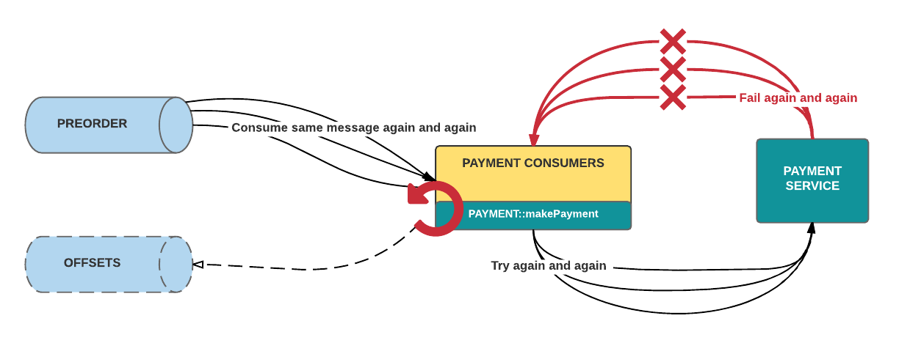
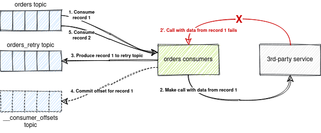
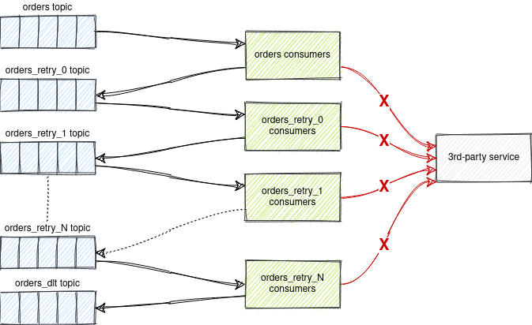

# Spring Kafka Non-Blocking Retries and Dead Letter Topics

## Introduction

This repository provides a sample of non-blocking retries and dead letter topics (
aka [reliable reprocessing and dead letter queues](https://eng.uber.com/reliable-reprocessing/))
with Apache Kafka. The sample is implemented using Spring Boot and Spring Kafka.

## Simple Retries

In distributed systems, retries are inevitable.

A quick and simple solution for implementing retries is to use a feedback cycle at the point of the
client call.



Retrying at the client level with a feedback cycle leeds to

* Clogged batch processing. When we are required to process a large number of messages in real time,
  repeatedly failed messages can clog batch processing. The worst offenders consistently exceed the
  retry limit, which also means that they take the longest and use the most resources. Without a
  success response, the Kafka consumer will not commit a new offset and the batches with these bad
  messages would be blocked, as they are re-consumed again and again.
* Difficulty retrieving metadata. It can be cumbersome to obtain metadata on the retries, such as
  timestamps and nth retry.

## Non-Blocking Retries and Dead Letter Topics

Request reprocessing (retries) must be non-blocking (done in separate topics) and delayed

* to not disrupt real-time traffic;
* to not amplify the number of calls, essentially spamming bad requests;
* for observability (obtain metadata on the retries, such as timestamps and *nth* retry).

Achieving non-blocking retry and DLT functionality with Kafka usually requires setting up extra
topics and creating and configuring the corresponding listeners.



If message processing fails, the message is forwarded to a retry topic with a back off timestamp.
The retry topic consumer then checks the timestamp and if it's not due it pauses the consumption for
that topic's partition. When it is due the partition consumption is resumed, and the message is
consumed again. If the message processing fails again the message will be forwarded to the next
retry topic, and the pattern is repeated until a successful processing occurs, or the attempts are
exhausted, and the message is sent to the Dead Letter Topic for visibility and diagnosis. Dead
letter messages are merged to re-enter processing by being published back into the first retry
topic. This way, they remain separate from, and are unable to impede, live traffic.

Errors trickle down levels of retry topics until landing in the DLQ.



It is important not to simply re-attempt failed requests immediately one after the other; doing so
will amplify the number of calls, essentially spamming bad requests. Consequently, our queues are
not so much retry queues as they are delayed processing queues, where the re-execution of error
cases is our best-effort delivery: handler invocation will occur at least after the configured
timeout but possibly later. In other words, it is guaranteed that a message will never be processed
before its due time.

We can also differentiate treatment of different types of errors, allowing cases such as network
flakiness to be re-attempted, while null pointer exceptions and other code bugs should go straight
into the DLQ because retries would not fix them.

### Advantages

* Unblocked batch processing. Failed messages enter their own designated channels, enabling
  successes in the same batch to proceed instead of requiring them to be reprocessed along with the
  failures. Thus, consumption of incoming requests moves forward unblocked, achieving higher
  real-time throughput.

### Disadvantages

* By using this strategy you lose Kafka's ordering guarantees for that topic.

## How to Implement a Back Off Delay?

A quick and simple solution (*not working!*) for implementing a back off delay (delayed message
processing) is by sleeping the consumer thread till due time (time the message was published to the
topic + delay time).

This approach doesn't work because you cannot sleep the consumer thread as Kafka will assume that it
is dead and will perform partition reassignment and pass that message to other consumers.

A Kafka consumer must be paused and resumed instead of sleeping the thread.

The retry topic consumer must check the timestamp, and if it's not due, pause the consumption for
that topic's partition. When it is due, the partition consumption is resumed, and the message is
consumed again.

## Topic Naming for Multiple Consumer Groups

If there are more than one consumer group, retry and DLT topics names have to include the consumer
group ID (`orders-myConsumerGroup1-retry-0`). Such naming is required because there can be multiple
applications consuming from the same topics with different consumer group IDs, and reprocessing of
failed messages must be independent for different consumer groups.

For example, application A processes a message successfully, while application B fails to process
the same message. In this case, this message must be reprocessed only by application A. Application
B must not consume this message from its retry topic because it has already successfully processed
it.

## Non-Blocking Retries in Spring Kafka

Since Spring Kafka 2.7.0 failed deliveries can be forwarded to a series of topics for delayed
redelivery.

It can described with an example:

```java
public class RetryableKafkaListener {

  @RetryableTopic(
      attempts = "4",
      backoff = @Backoff(delay = 1000, multiplier = 2.0),
      autoCreateTopics = "false",
      topicSuffixingStrategy = TopicSuffixingStrategy.SUFFIX_WITH_INDEX_VALUE)
  @KafkaListener(topics = "orders")
  public void listen(String in, @Header(KafkaHeaders.RECEIVED_TOPIC) String topic) {
    log.info(in + " from " + topic);
    throw new RuntimeException("test");
  }

  @DltHandler
  public void dlt(String in, @Header(KafkaHeaders.RECEIVED_TOPIC) String topic) {
    log.info(in + " from " + topic);
  }
}
```

With this configuration, the first delivery attempt fails and the record is sent to a
topic `order-retry-0` configured for a 1-second delay. When that delivery fails, the record is sent
to a topic `order-retry-1` with a 2-second delay. When that delivery fails, it goes to a
topic `order-retry-2` with a 4-second delay, and, finally, to a dead letter topic `orders-dlt` with
an (optional) `@DltHandler` method.

The first attempt counts against the `maxAttempts`, so if you provide a `maxAttempts` value of 4
there'll be the original attempt plus 3 retries.

This allows processing of subsequent records from the same partition while retrying the failed
record.

## How to Run the Sample?

1. Download & install OpenJDK 11 (LTS) at [AdoptOpenJDK](https://adoptopenjdk.net/).
2. Build the sample and run all tests
   ```bash
   ./gradlew clean test -i
   ```
   By default, embedded Kafka broker is started at port `19092`. You can set a port for the embedded
   Kafka broker using `kafka.embedded.port` property
   ```bash
   ./gradlew clean test -i -Dkafka.embedded.port=29092
   ```